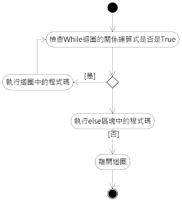

# 指定條件迴圈

大多數的程式語言都有指令，可以在特定條件成立時繼續迴圈的進行，或是特定條件不成立時繼續迴圈的進行，進行到特定條件成立為止。前者一般會標示while，後者一般會標示until。



其判斷條件可能在迴圈一開始就進行，或是在迴圈最後才進行。前者的迴圈不一定會執行，而後者1的迴圈至少會執行一次。

```text
public static void main(str args[]){
    while true{
        System.out.println("Hello World!") //因為條件已經固定為true，所以會一直重複這句話
    }
    int counter = 0 ;
    while counter<5{
        System.out.println("已經顯示"+counter+"次")  //因為條件限定counter不能大於5，所以在counter不大於5的情况下會不斷重複内容
        counter++;
    }
}
```


